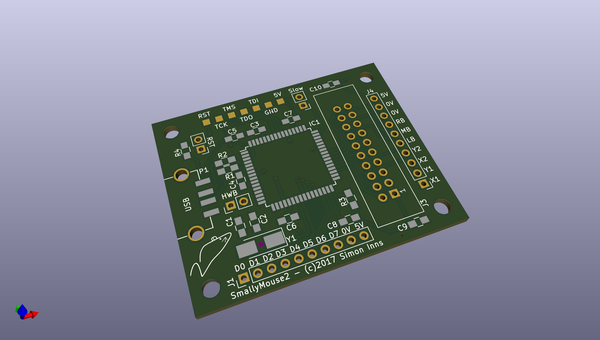
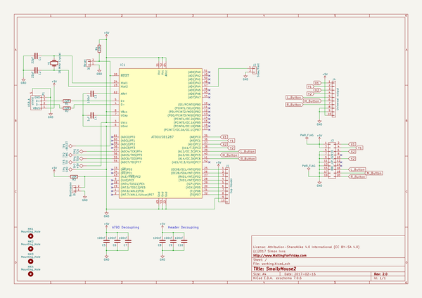

# OOMP Project  
## SmallyMouse2  by myelin  
  
oomp key: oomp_projects_flat_myelin_smallymouse2  
(snippet of original readme)  
  
-- Synopsis  
  
SmallyMouse2 is the AT90USB1287 firmware source code and KiCAD schematic/PCB design for the SmallyMouse2 project.  
  
-- Motivation  
  
SmallyMouse2 is a project that creates a USB mouse adaptor for retro computers that use quadrature mouse input including the Acorn BBC Micro, Acorn Master series, Commodore Amiga, Atari ST, busmouse compatible computers and many more.  SmallyMouse2 provides both a generic mouse output header (for attaching mouse to retro computer cables) and an IDC connector suitable for use with Acorn 8-bit user-ports.  SmallyMouse2 also features a configurable quadrature rate limiter that prevents VIA overrun when in use with slower 8-bit machines.  
  
SmallyMouse2 supports both JTAG and USB bootloader programming.  The AT90USB1287 is pre-programmed by Atmel with the (FLIP) DFU bootloader; this bootloader is recognised by Atmel Studio as a programming device and can be used to flash the firmware to the board.  
  
-- Installation  
  
Note: This is an Atmel Studio 7 project that can be loaded and compiled by the IDE  
  
Please see http://www.waitingforfriday.com/?p=827 for detailed documentation about SmallyMouse2  
  
-- Author  
  
SmallyMouse2 is written and maintained by Simon Inns.  
  
-- License (Software)  
  
    SmallyMouse2 is free software: you can redistribute it and/or modify  
    it under the terms of the GNU General Public License as published by  
    the Free Software Foundation, either version 3 of the License, or  
    (at your option) any later version.  
  
    Small  
  full source readme at [readme_src.md](readme_src.md)  
  
source repo at: [https://github.com/myelin/SmallyMouse2](https://github.com/myelin/SmallyMouse2)  
## Board  
  
  
## Schematic  
  
  
  
[schematic pdf](working_schematic.pdf)  
## Images  
