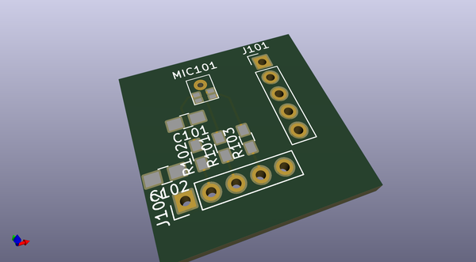

# OOMP Project  
## ElecSnip  by natsfr  
  
(snippet of original readme)  
  
- ElecSnip  
Electronic Snippet  
Storing all idea/crap/piece/circuit/thought  
  
No interest for anyone else.  
  full source readme at [readme_src.md](readme_src.md)  
  
source repo at: [https://github.com/natsfr/ElecSnip](https://github.com/natsfr/ElecSnip)  
## Board  
  
  
## Schematic  
  
  
  
[schematic pdf](working_schematic.pdf)  
## Images  
