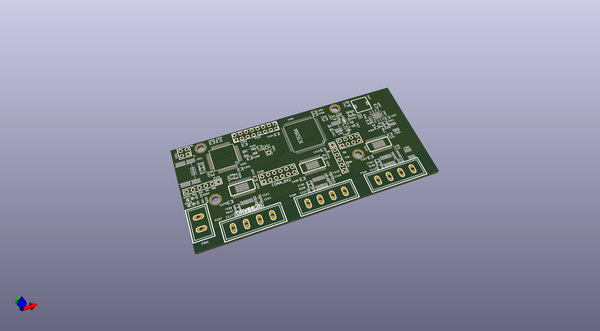

# OOMP Project  
## pmsre  by natsfr  
  
oomp key: oomp_projects_flat_natsfr_pmsre  
(snippet of original readme)  
  
-Powerful Motor System that Rocks Everything  
  
--Presentation  
PMSRE is a motor control system originally designed to drive a PCB CNC, a 3D printer and a microscope stage.  
This project is based on a STM32F103 + 3x DRV8825 from TI and a Xilinx FPGA Spartan3A 50k or 200k. The main  
point of using FPGA is too provide an easy way to extend the board with daughter board and to make real  
line and curve machining in CNC.  
  
--Hardware  
  
  PCB is 4 Layers.  
  
--Software  
  
  OpenOCD scripts  
  ---------------  
  
  GDB  : openocd -f scripts/openocd/pmsre.cfg -c "gdb_port 4000"  
  FLASH: openocd -f scripts/openocd/pmsre.cfg -c "program <elf binary> verify reset"  
  
  full source readme at [readme_src.md](readme_src.md)  
  
source repo at: [https://github.com/natsfr/pmsre](https://github.com/natsfr/pmsre)  
## Board  
  
  
## Schematic  
  
  
  
[schematic pdf](working_schematic.pdf)  
## Images  
