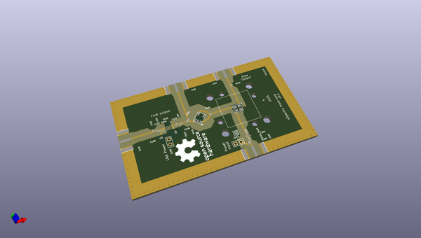
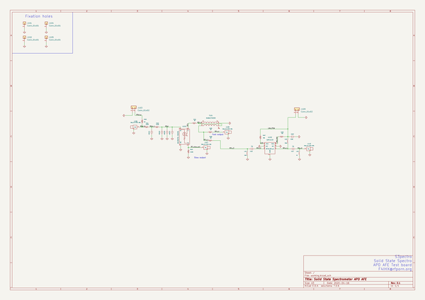

# OOMP Project  
## s3pectro  by natsfr  
  
oomp key: oomp_projects_flat_natsfr_s3pectro  
(snippet of original readme)  
  
- s3pector  
Solid State Spectrometer front end  
  
  full source readme at [readme_src.md](readme_src.md)  
  
source repo at: [https://github.com/natsfr/s3pectro](https://github.com/natsfr/s3pectro)  
## Board  
  
  
## Schematic  
  
  
  
[schematic pdf](working_schematic.pdf)  
## Images  
