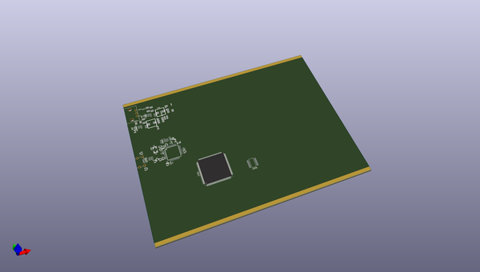
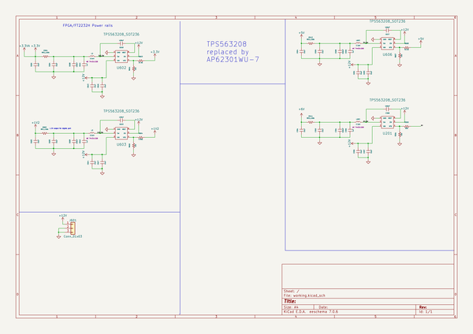

# OOMP Project  
## VNAV1.2  by natsfr  
  
oomp key: oomp_projects_flat_natsfr_vnav1_2  
(snippet of original readme)  
  
  
  full source readme at [readme_src.md](readme_src.md)  
  
source repo at: [https://github.com/natsfr/VNAV1.2](https://github.com/natsfr/VNAV1.2)  
## Board  
  
  
## Schematic  
  
  
  
[schematic pdf](working_schematic.pdf)  
## Images  
