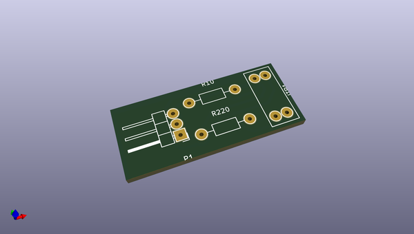
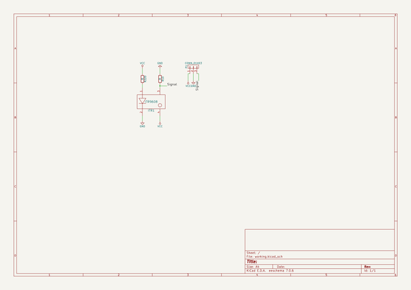

# OOMP Project  
## Thor  by naturesyouth  
  
(snippet of original readme)  
  
  
  
Thor is an Open Source and printable robotic arm with six degrees of freedom.  
Its configuration (yaw-roll-roll-yaw-roll-yaw) is the same one that is used on most manipulator robots that currently exist in the market.  
In its upright position, Thor is about 625mm and it can lift objects up to 750 grams.  
  
  
  
The project started a year ago as my Final Degree Project called "Design and startup of an Open Source and printable 6DOF robotic arm" but a lot of things have changed since the presentation day.  
  
The main purpose of this project was to create a robotic arm that could be used in universities and schools to teach robotics instead of using simulation software or low accurate models. Having this in mind, the final prototype had to be affordable and, of course, Open Source. Once the project begun, I realized that it could be helpful in many areas I had not imagined when I first came up with the idea: small automations, training in factories, makers...  
  
As I said, this is a low-cost robotic arm. The cost of the whole materials is under 350€. Being this affordable, I think almost every school/university/maker could make good use of one at least!  
  
In terms of licenses, I wanted this project to be Open Source because I want anyone to have the opportunity to study, modify and improve it. Given this decision, I designed it entirely using Open Source software. This way, everyone can o  
  full source readme at [readme_src.md](readme_src.md)  
  
source repo at: [https://github.com/naturesyouth/Thor](https://github.com/naturesyouth/Thor)  
## Board  
  
  
## Schematic  
  
  
  
[schematic pdf](working_schematic.pdf)  
## Images  
