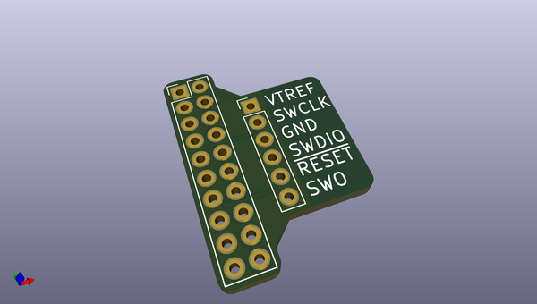
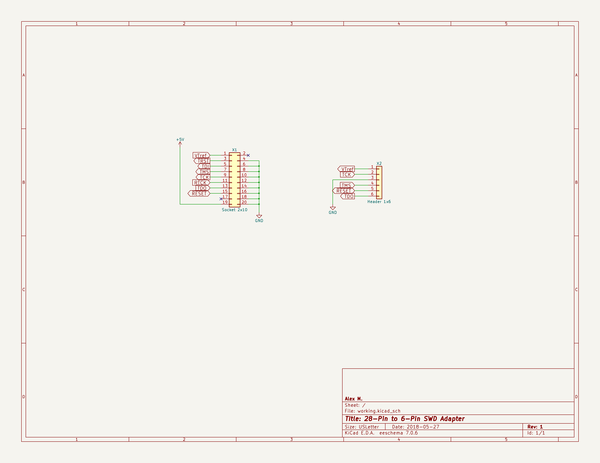

# OOMP Project  
## Adapter_JTAG20PinTo6Pin  by newAM  
  
(snippet of original readme)  
  
-- 20-Pin to 6-Pin adapter for JTAG debuggers  
  
This project is a small PCB adapter to convert a 20-Pin JTAG interface into a 6-Pin interface with these signals:  
* VTREF  
* SWCLK  
* GND  
* SWDIO  
* RESET  
* SWO  
  
-- Media  
  
  
-- Project Contents  
-  Adapter_JTAG20PinTo6Pin_KiCAD - KiCad PCB and schematic files  
-  Adapter_JTAG20PinTo6Pin_Media - photos  
  
-- Software Used  
- [KiCad](http://kicad-pcb.org/) 5.0.0 release  
  
  full source readme at [readme_src.md](readme_src.md)  
  
source repo at: [https://github.com/newAM/Adapter_JTAG20PinTo6Pin](https://github.com/newAM/Adapter_JTAG20PinTo6Pin)  
## Board  
  
  
## Schematic  
  
  
  
[schematic pdf](working_schematic.pdf)  
## Images  
