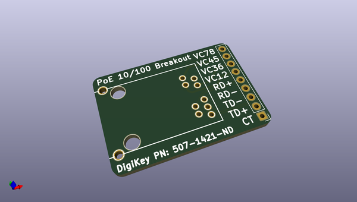
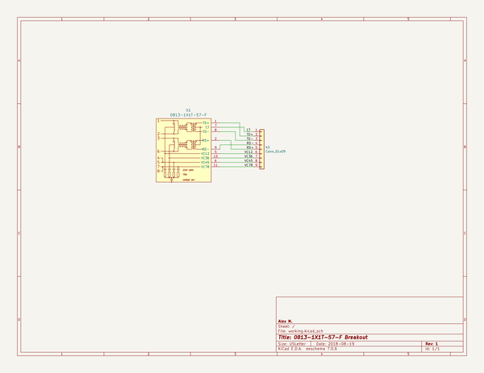

# OOMP Project  
## Breakout_0813-1X1T-57-F  by newAM  
  
oomp key: oomp_projects_flat_newam_breakout_0813_1x1t_57_f  
(snippet of original readme)  
  
-- PoE 10/100 Magjack 0813-1X1T-57-F Breakout  
  
This project is a small PCB breakout for the 0813-1X1T-57-F 10/100 PoE magjack for 2.54mm breadboard prototype usability.  
  
-- Media  
  
  
-- Project Contents  
-  Breakout_0813-1X1T-57-F_KiCAD - KiCad PCB and schematic files  
-  Breakout_0813-1X1T-57-F_Media - photos  
  
-- Software Used  
- [KiCad](http://kicad-pcb.org/) 5.0.0 release  
  
  full source readme at [readme_src.md](readme_src.md)  
  
source repo at: [https://github.com/newAM/Breakout_0813-1X1T-57-F](https://github.com/newAM/Breakout_0813-1X1T-57-F)  
## Board  
  
  
## Schematic  
  
  
  
[schematic pdf](working_schematic.pdf)  
## Images  
