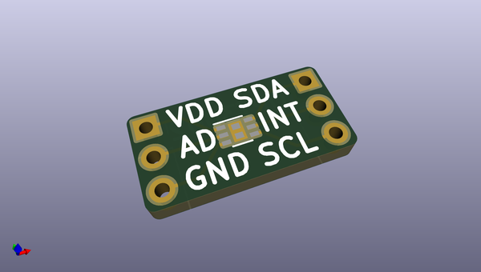
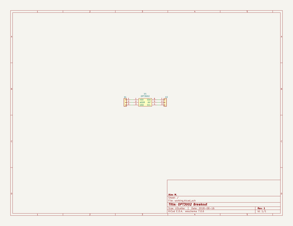

# OOMP Project  
## Breakout_OPT3002  by newAM  
  
oomp key: oomp_projects_flat_newam_breakout_opt3002  
(snippet of original readme)  
  
-- OPT3002 I2C Ambient Light Sensor Breakout  
  
This project is a PCB breakout for the Texas Instruments OPT3002 I2C ambient light sensor.  
  
-- Media  
  
  
-- Project Contents  
-  Breakout_OPT3002_KiCAD - KiCad PCB and schematic files  
-  Breakout_OPT3002_Media - photos  
  
-- Software Used  
- [KiCad](http://kicad.org/) 5.0.0 release  
  
  full source readme at [readme_src.md](readme_src.md)  
  
source repo at: [https://github.com/newAM/Breakout_OPT3002](https://github.com/newAM/Breakout_OPT3002)  
## Board  
  
  
## Schematic  
  
  
  
[schematic pdf](working_schematic.pdf)  
## Images  
