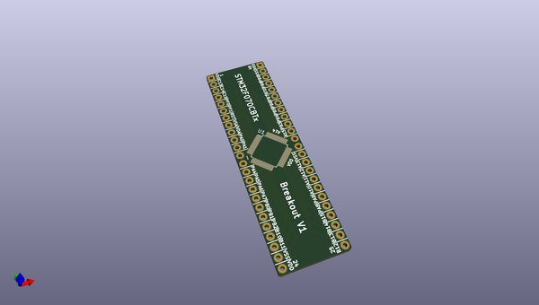
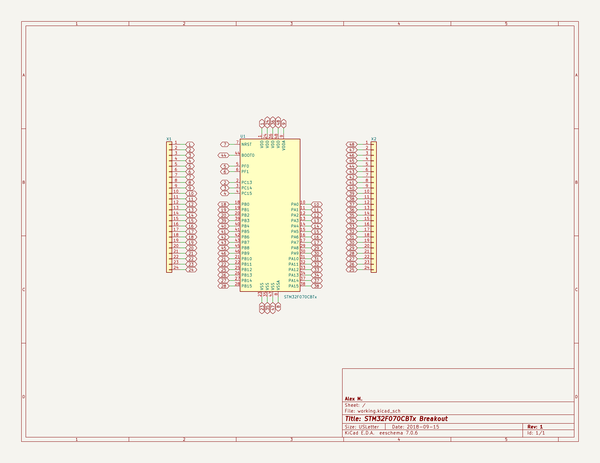

# OOMP Project  
## Breakout_STM32F070CBTx  by newAM  
  
(snippet of original readme)  
  
-- STM32F070CBTx PCB Breakout  
  
This project is a PCB breakout for the STM32F070CBTx 7x7mm LQFP package micro controller.  
  
-- Media  
  
  
-- Project Contents  
-  Breakout_STM32F070CBTx_KiCAD - KiCAD PCB and schematic files  
-  Breakout_STM32F070CBTx_Media - photos  
  
-- Software Used  
- [KiCAD](http://kicad-pcb.org/) 5.0.0 release  
  
  full source readme at [readme_src.md](readme_src.md)  
  
source repo at: [https://github.com/newAM/Breakout_STM32F070CBTx](https://github.com/newAM/Breakout_STM32F070CBTx)  
## Board  
  
  
## Schematic  
  
  
  
[schematic pdf](working_schematic.pdf)  
## Images  
