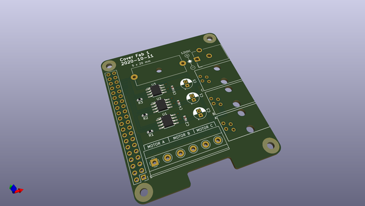

# OOMP Project  
##   by   
  
(snippet of original readme)  
  
- Cover  
  
A controller to automate my window shades.  
  
This project is from late 2020; much older than the commit dates indicate.  I revisited it to migrate the raspberry pi controller to NixOS and decided to document the project.  
  
-- Software  
  
* [NixOS](https://nixos.org/) for the raspberry pi OS  
* [KiCad](https://www.kicad.org/) (version 5) for PCB design  
* [OpenSCAD](https://openscad.org/) for 3D printed parts  
  
-- Hardware  
  
The hardware consists of:  
  
* A raspberry pi  
* A custom pi hat to drive motors  
* A motor per shade  
* Plastic 3D printed motor mounts  
* Metal 3D printed grips  
* Plastic 3D printed guides  
* 2 reed switches on each shade for endstops  
  
--- Shades  
  
The shades on my windows have a continuous ball chain string without any clasps.  The ball chain originally had some plastic stoppers on them, but these all broke off before this project due to UV exposure.  
  
The windows have a clutch on them, I measured the force required to overcome this clutch by tieing a water bottle onto the ball chain, and filling it with water until the chain started to move.  The final weight of the water bottle was 2 kilos ∴ about 20N of force is required to move the shades.  
  
--- Motors  
  
I purchased generic 12V motors online, if you search "DC 12V worm gear motor" you will find these easily at almost every retailer.  These had more than enough torque to overcome the 20N of the clutch.  
  
  
  
I purchased 25 rpm motors, which was lower than I needed.  The grips ended up being   
  full source readme at [readme_src.md](readme_src.md)  
  
source repo at:   
## Board  
  
  
## Schematic  
  
  
  
[schematic pdf](working_schematic.pdf)  
## Images  
