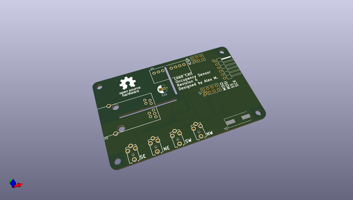

# OOMP Project  
##   by   
  
(snippet of original readme)  
  
-- Load Cell Occupancy Sensor  
  
--- What is it?  
This project is a occupancy sensor that uses a load cell for couches and beds, transmitting data to my Home Assistant server via MQTT over Ethernet.  
  
--- Why?  
Other bed occupancy sensors that I have used in my home automation setup trigger false negatives when rolling around at night.  I use bed occupancy to turn on my lights if I get up at night, and I wanted a faster, more accurate solution.  
  
---- Why PoE?  
Wireless home automation devices often make sense only when they are battery powered, if a power cable needs to be run to the device it can carry data too.  Designing a low power wireless device is far more complicated than designing a wired device and running an Ethernet cable.  
  
-- Overview  
Load cells → HX711 (ADC) → ATMega328P (MCU) → W5100 (Ethernet) → MQTT Broker → Home Assistant  
  
This sensor takes input from 4 load cells, each supporting one leg of a bed or couch.  The load cells are sampled with a ATMega328P (Arduino) using an HX711 load cell ADC.  These samples are then transmitted to an MQTT broker via the Wiznet W5100 (same as Arduino Ethernet shield).  
  
-- Project Contents  
-  LoadCell_ArduinoCode - firmware for the ATMega328P  
-  LoadCell_Case - 3D printable case designed in OpenSCAD  
-  LoadCell_Holder - 3D printable holder for the load cells designed in OpenSCAD  
-  LoadCell_HomeAssistant - example Home Assistant configuration  
-  LoadCell_KiCAD - schematic and PCB  
  
-- Media  
  
  
source repo at:   
## Board  
  
  
## Schematic  
  
  
  
[schematic pdf](working_schematic.pdf)  
## Images  
