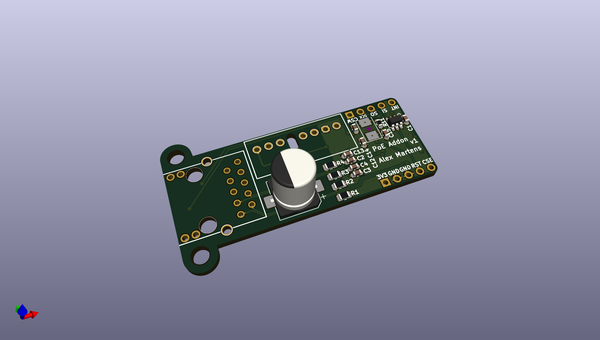
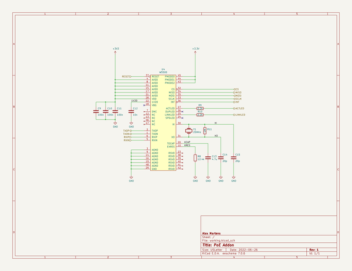

# OOMP Project  
##   by   
  
oomp key:   
(snippet of original readme)  
  
- PoE Addon  
  
Simple board to add power over Ethernet to a project.  
  
This uses the [Wiznet W5500] for TCP/IP offload, and a [Microchip 25AA02E48] for  
a valid EUI-48 MAC address.  
  
Proceed with caution, I have not made this yet due to part shortages.  
  
-- Bill of Materials  
  
A bill of materials generated by [InteractiveHtmlBom] can be viewed at <https://newam.github.io/poe-addon/>  
  
-- Media  
  
  
  
  
-- Software Used  
  
- [KiCad](http://kicad.org/) 7.0.0 release  
  
[InteractiveHtmlBom]: https://github.com/openscopeproject/InteractiveHtmlBom/issues  
[Wiznet W5500]: https://www.wiznet.io/product-item/w5500/  
[Microchip 25AA02E48]: http://ww1.microchip.com/downloads/en/devicedoc/22123a.pdf  
  
  full source readme at [readme_src.md](readme_src.md)  
  
source repo at:   
## Board  
  
  
## Schematic  
  
  
  
[schematic pdf](working_schematic.pdf)  
## Images  
