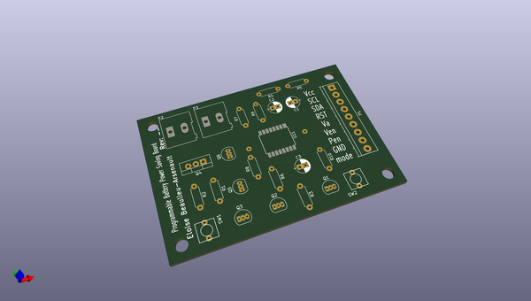

# OOMP Project  
## Programmable-Battery-Power-Saving-Board  by nickgagnon  
  
oomp key: oomp_projects_flat_nickgagnon_programmable_battery_power_saving_board  
(snippet of original readme)  
  
- Programmable-Battery-Power-Saving-Board  
Board to save battery life using a RTC to disconnect the battery power from the load.  
  
  full source readme at [readme_src.md](readme_src.md)  
  
source repo at: [https://github.com/nickgagnon/Programmable-Battery-Power-Saving-Board](https://github.com/nickgagnon/Programmable-Battery-Power-Saving-Board)  
## Board  
  
  
## Schematic  
  
  
  
[schematic pdf](working_schematic.pdf)  
## Images  
