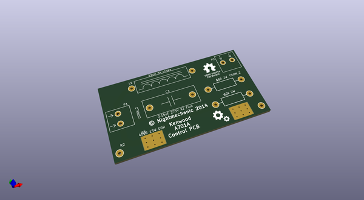
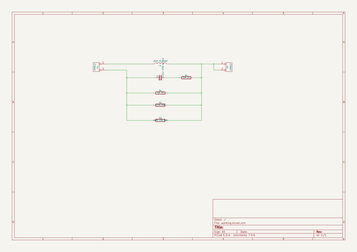

# OOMP Project  
## Kenwood_A701A_control_pcb  by nightmechanic  
  
oomp key: oomp_projects_flat_nightmechanic_kenwood_a701a_control_pcb  
(snippet of original readme)  
  
Kenwood_A701A_control_pcb  
=========================  
  
This is a Control PCB for a Kenwood A701A kitchen mixer.  
  
Created for our kitchen mixer restoration project.  
  
Benefits:  
  - Allows using a common 470 ohm 25W cement resistor (+ a 2W 10kohm ) instead of the expensive DR type resistor originaly used by Kenwood.  
  - Uses terminal blocks for wire connections  
  - the components are mounted on the PCB instead of floating around...  
  
  full source readme at [readme_src.md](readme_src.md)  
  
source repo at: [https://github.com/nightmechanic/Kenwood_A701A_control_pcb](https://github.com/nightmechanic/Kenwood_A701A_control_pcb)  
## Board  
  
  
## Schematic  
  
  
  
[schematic pdf](working_schematic.pdf)  
## Images  
