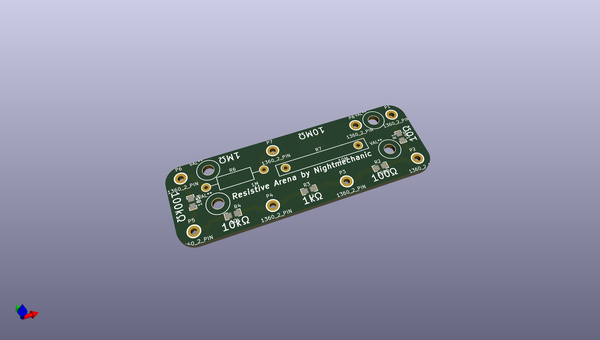
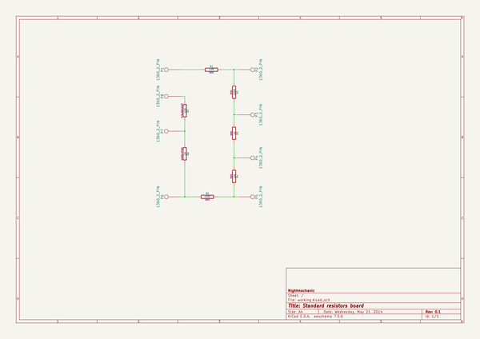

# OOMP Project  
## Resistive_Arena  by nightmechanic  
  
oomp key: oomp_projects_flat_nightmechanic_resistive_arena  
(snippet of original readme)  
  
Resistive_Arena  
===============  
  
Standard resistors board  
  
This is a small project for a board with a few relatively accurate resistors with (relatively...) low temperature coeficients.  
The purpose is to allow performance checking and possible calibration of Multimeters (not high accuracy ones, of course).  
  
The project was budget limited, so I collected the best value for money resistors I could find, resulting in some SMT resistors and a couple of, different, through-hole resistors.  
  
  full source readme at [readme_src.md](readme_src.md)  
  
source repo at: [https://github.com/nightmechanic/Resistive_Arena](https://github.com/nightmechanic/Resistive_Arena)  
## Board  
  
  
## Schematic  
  
  
  
[schematic pdf](working_schematic.pdf)  
## Images  
