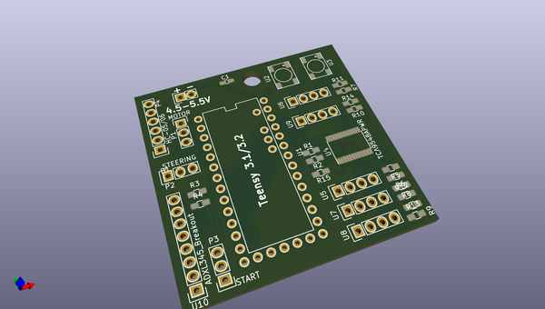
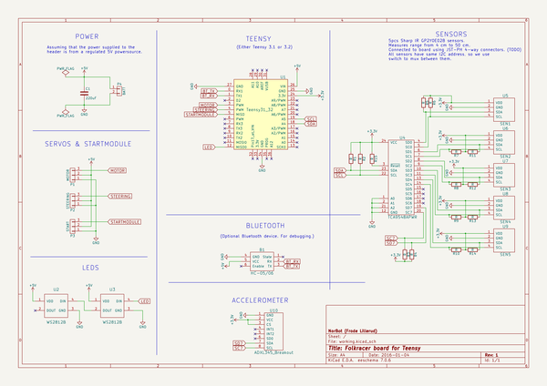

# OOMP Project  
## KicadTeensyFolkrace  by NorbotNorway  
  
oomp key: oomp_projects_flat_norbotnorway_kicadteensyfolkrace  
(snippet of original readme)  
  
- KicadTeensyFolkrace  
Schematic and PCB for a Teensy-folkracer. Made with KiCad.  
  
  full source readme at [readme_src.md](readme_src.md)  
  
source repo at: [https://github.com/NorbotNorway/KicadTeensyFolkrace](https://github.com/NorbotNorway/KicadTeensyFolkrace)  
## Board  
  
  
## Schematic  
  
  
  
[schematic pdf](working_schematic.pdf)  
## Images  
