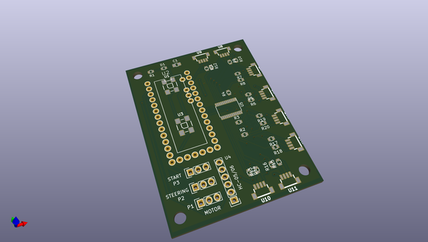
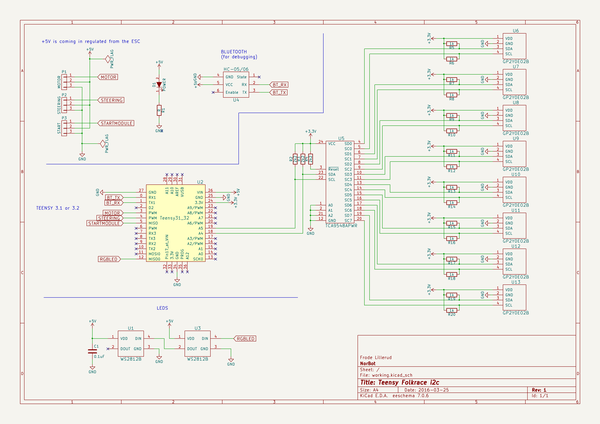

# OOMP Project  
## KiCadTeensyFolkracePro  by NorbotNorway  
  
oomp key: oomp_projects_flat_norbotnorway_kicadteensyfolkracepro  
(snippet of original readme)  
  
- KiCadTeensyFolkracePro  
PCB made with KiCad. For Teensy and i2c GP2Y... sensor  
  
(The JST SH 1mm connectors are from http://www.kicadlib.org/)  
  
  full source readme at [readme_src.md](readme_src.md)  
  
source repo at: [https://github.com/NorbotNorway/KiCadTeensyFolkracePro](https://github.com/NorbotNorway/KiCadTeensyFolkracePro)  
## Board  
  
  
## Schematic  
  
  
  
[schematic pdf](working_schematic.pdf)  
## Images  
