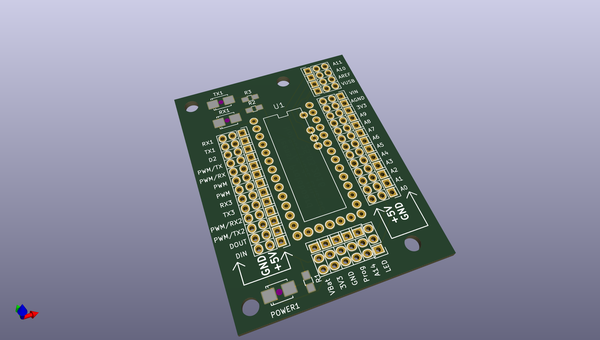
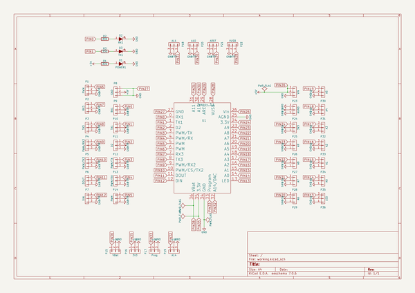

# OOMP Project  
## TeensyProtoboard  by NorbotNorway  
  
(snippet of original readme)  
  
- TeensyProtoboard  
A Teensy breakout card  
  
Makes it easy to do prototyping with the Teensy (3.1/3.2).  
  
All pins are broken out to separate headers. The outermost headers are GND, the middle are +5V, and the inner (closes to Teensy) are datapins.  
  
There is a Power-LED, and a RX and TX LED for displaying serial communication.  
  
  
  
- TODO  
  
- i2c resistors  
  
  full source readme at [readme_src.md](readme_src.md)  
  
source repo at: [https://github.com/NorbotNorway/TeensyProtoboard](https://github.com/NorbotNorway/TeensyProtoboard)  
## Board  
  
  
## Schematic  
  
  
  
[schematic pdf](working_schematic.pdf)  
## Images  
