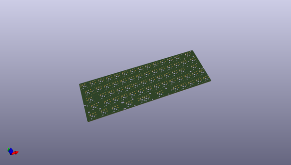
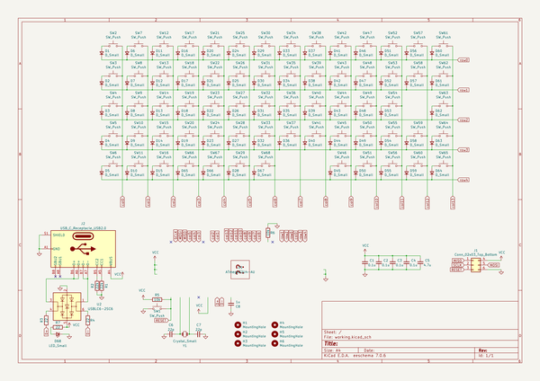

# OOMP Project  
## cringe65  by notsockx  
  
oomp key: oomp_projects_flat_notsockx_cringe65  
(snippet of original readme)  
  
- cringe65  
65% keyboard with 3 split spacebar support and MX, Alps, and Kailh socket compatability.  
  
Name comes from the fact that i do not like the keyboard but i couldn't care to change it since i already made it lol  
  
- Features  
- USBLC6-2SC6 for ESD protection  
- USB Type C  
- GH60 Mounting  
- Kailh Socket, MX switch, and Alps compatibility    
- Through hole diodes for easier assembly  
- 6.25u or 2u x 1.25u x 3u support  
  
  full source readme at [readme_src.md](readme_src.md)  
  
source repo at: [https://github.com/notsockx/cringe65](https://github.com/notsockx/cringe65)  
## Board  
  
  
## Schematic  
  
  
  
[schematic pdf](working_schematic.pdf)  
## Images  
