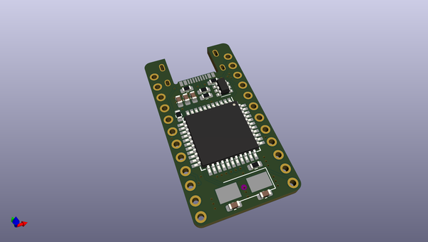
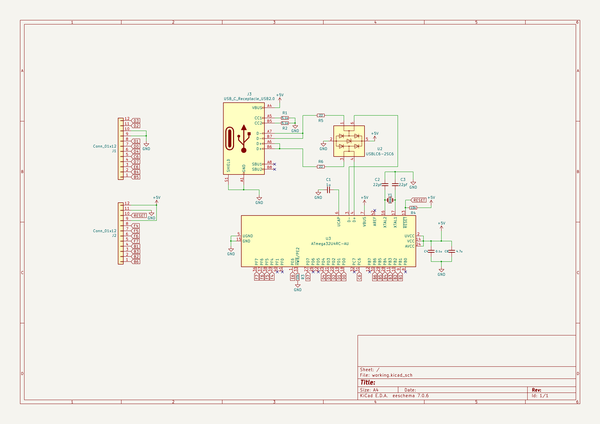

# OOMP Project  
## microc  by notsockx  
  
(snippet of original readme)  
  
- microc  
Sparkfun Pro Micro compatible board with USB-C support  
  
- Features  
- Fully pin compatible with Sparkfun Pro Micro  
- 5V POWER ONLY  
- Midmount USB-C connector for durability  
- ESD protection from USBLC6-2SC6 IC  
- TQFP ATMega32u4 for easier DIY assembly  
- DIY-friendly 0602 SMD components  
  
  full source readme at [readme_src.md](readme_src.md)  
  
source repo at: [https://github.com/notsockx/microc](https://github.com/notsockx/microc)  
## Board  
  
  
## Schematic  
  
  
  
[schematic pdf](working_schematic.pdf)  
## Images  
