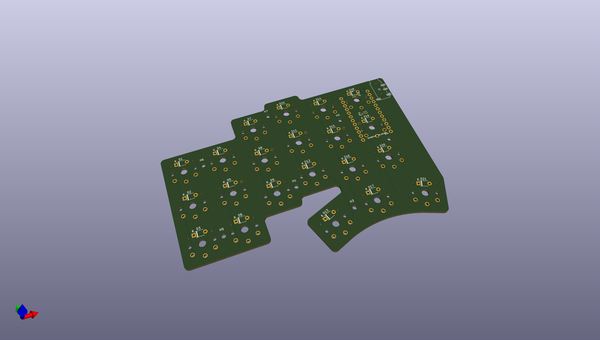
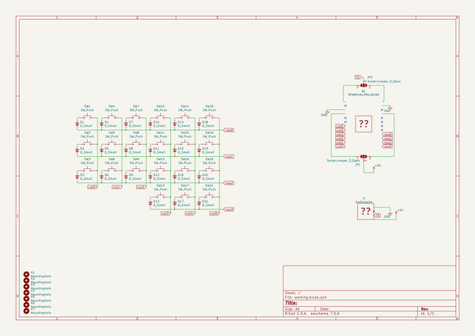

# OOMP Project  
## notcorne  by notsockx  
  
(snippet of original readme)  
  
- notcorne  
Corne-styled Kailh Choc switch keyboard.  
  
- Features  
MCU: ATMega32u4 (Pro Micro)    
Switches: Kailh Choc    
Connectivity: RJ11 for both halves    
  
- To-do  
- Adjust collum stagger  
- Adjust thumb cluster  
  
  full source readme at [readme_src.md](readme_src.md)  
  
source repo at: [https://github.com/notsockx/notcorne](https://github.com/notsockx/notcorne)  
## Board  
  
  
## Schematic  
  
  
  
[schematic pdf](working_schematic.pdf)  
## Images  
