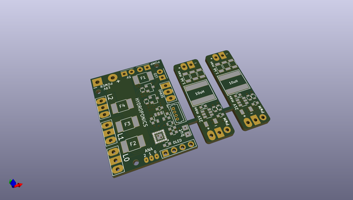
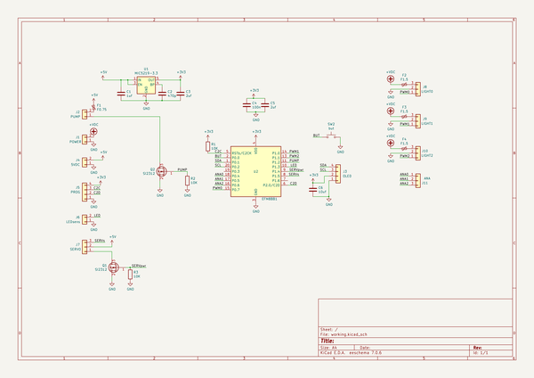

# OOMP Project  
## AutoWatering  by nppc  
  
oomp key: oomp_projects_flat_nppc_autowatering  
(snippet of original readme)  
  
- Periodic watering  
Simple periodic watering controller  
With OLED 96x16 pixels.  
  
Two states of operation.  
Waiting (configurable, max 99 hours and 59 minutes)  
While waiting after 3 minutes of state change it goes to savescreen mode.  
In this mode you see the random dots. Dots quantity is minutes remaining (but not more than 40 dots).  
  
  
Watering (configurable, max 99 minutes and 59 seconds)  
While watering low mosfet is turned on.  
  
  
-- Configuration  
Press and hold button until wait time start blink. If you need to adjust watering time, then hold button longer.  
  
With short presses change number 1 by 1. With long press - numbers is running.  
If button is not pressed for more than 3 seconds, then next number will be available for adjust.  
  
New time is stored in eeprom.  
  
  full source readme at [readme_src.md](readme_src.md)  
  
source repo at: [https://github.com/nppc/AutoWatering](https://github.com/nppc/AutoWatering)  
## Board  
  
  
## Schematic  
  
  
  
[schematic pdf](working_schematic.pdf)  
## Images  
