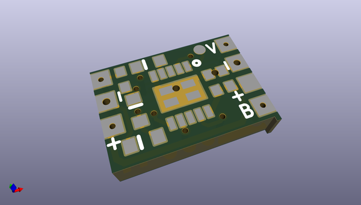
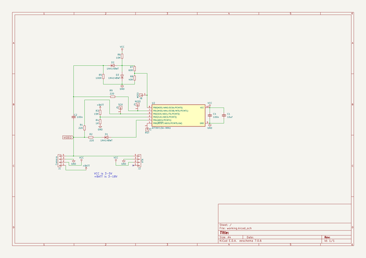

# OOMP Project  
## B-uOSD  by nppc  
  
(snippet of original readme)  
  
- Battery voltage microOSD v1.2  
Very small and simple OSD for monitoring Battery voltage. It is useful for AIO micro cameras, FPV helmet etc.  
  
The PCB is very small. Can be ordered at OshPark: https://oshpark.com/shared_projects/nvOy0lBm  
  
  
  
-- Functionality  
- Supports 1S-4S battery monitoring. (Changing onboard voltage divider can be extended for bigger batteries.)  
- Adjustable text position.  
- Shows current voltage and minimal detected voltage.  
- Pilot name, Crosshair and timer.  
- Voltage blinking if battery running low.  
- Supply voltage 3.3-5.5v.  
- Low supply current, no heat generation.  
- It is very small size (8.8mm X 6mm).  
- Virtually weights nothing.  
- Configurable parameters via compiling.  
  
It has minuses too.  
- Due to small and slow mcu (no special mcu for signal generation) the OSD picture is not as stable as other bigger OSDs.  
- No shadow around the symbols (not visible on white background). Planned it rhe future releases.  
  
Discussion is here: https://www.rcgroups.com/forums/showthread.php?2985720-uOSD-World-smallest-micro-OSD  
  
Some screenshots:  
  
  
  
-- Connection  
There is many possibilities to use this OSD.  
One example for 1S setup:  
  
  
Another example for AIO combo camera/vtx 1S setup:  
  
  
-- Comp  
  full source readme at [readme_src.md](readme_src.md)  
  
source repo at: [https://github.com/nppc/B-uOSD](https://github.com/nppc/B-uOSD)  
## Board  
  
  
## Schematic  
  
  
  
[schematic pdf](working_schematic.pdf)  
## Images  
