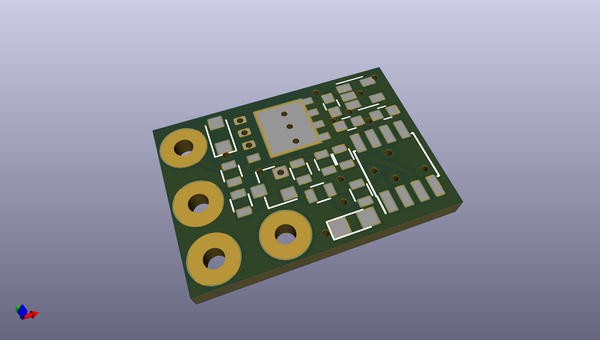
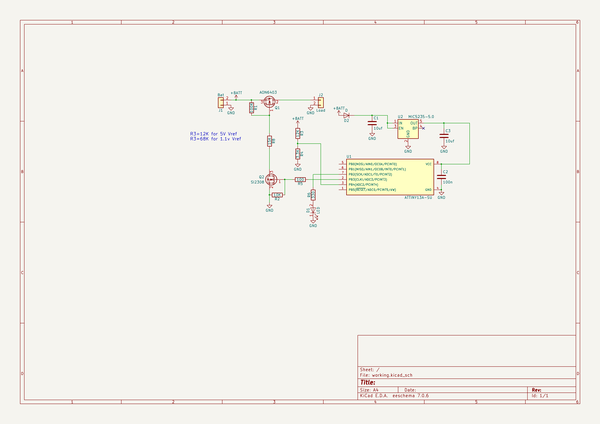

# OOMP Project  
## BatteryProtection  by nppc  
  
(snippet of original readme)  
  
- Protection circuit for 5S LiIon Battery  
The battery is used in mine grass trimmer.  
  
The protection circuit monitoring battery voltage and turns load off if battery gets empty.  
  
  
  
Maximum input voltage is 23V.  
  
Low voltage threshold is 15v.  
  
Please make sure, that if your internal reference is 1.1v, then R3 is 68K, not 12K. 12K is for 5V reference.  
  
-- Components placement  
  
  
-- Indication  
When led blinks with long pauses, then battery is not empty.  
  
When led is constantly on then battery is empty, load is disconnected. To reset the board you need to disconnect the battery.  
  full source readme at [readme_src.md](readme_src.md)  
  
source repo at: [https://github.com/nppc/BatteryProtection](https://github.com/nppc/BatteryProtection)  
## Board  
  
  
## Schematic  
  
  
  
[schematic pdf](working_schematic.pdf)  
## Images  
