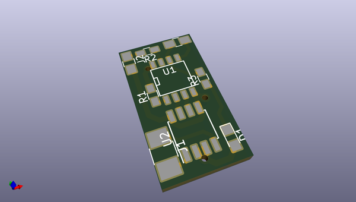
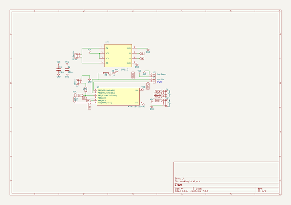

# OOMP Project  
## BedLevelingSensor  by nppc  
  
(snippet of original readme)  
  
- BedLevelingSensor  
  full source readme at [readme_src.md](readme_src.md)  
  
source repo at: [https://github.com/nppc/BedLevelingSensor](https://github.com/nppc/BedLevelingSensor)  
## Board  
  
  
## Schematic  
  
  
  
[schematic pdf](working_schematic.pdf)  
## Images  
