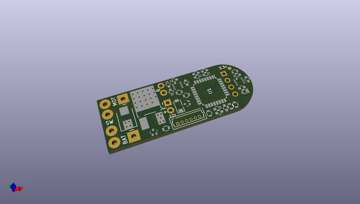
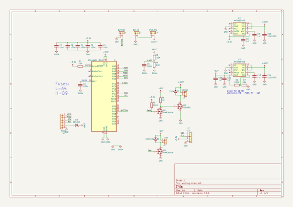

# OOMP Project  
## ChainSawDIY  by nppc  
  
(snippet of original readme)  
  
- ChainSawDIY  
DIY Battery ChainSaw for garden  
  
AtMega8L fuses:  
  
L=A4  
  
H=D9  
  
  
  
  full source readme at [readme_src.md](readme_src.md)  
  
source repo at: [https://github.com/nppc/ChainSawDIY](https://github.com/nppc/ChainSawDIY)  
## Board  
  
  
## Schematic  
  
  
  
[schematic pdf](working_schematic.pdf)  
## Images  
