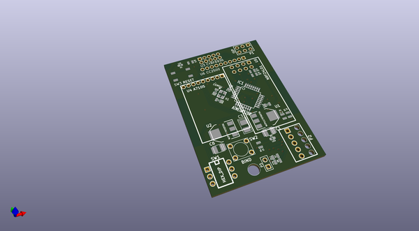

# OOMP Project  
## DIY-Multiprotocol-TX-Module  by nppc  
  
oomp key: oomp_projects_flat_nppc_diy_multiprotocol_tx_module  
(snippet of original readme)  
  
- Multiprotocol TX Module  
  
  
The **Multiprotocol Tx Module** (or **MULTI-Module**) is a 2.4GHz transmitter module which enables almost any transmitter to control many different receivers and models, including many popular helicopters, planes, quadcopters, and miniquads.  
  
The main forum for protocol requests and questions is on [RCGroups.com](https://www.rcgroups.com/forums/showthread.php?2165676-DIY-Multiprotocol-TX-Module/page10000).  
  
If you like this project and want to support further development please consider making a [donation](docs/Donations.md).    
  
<table cellspacing=0>  
  <tr>  
    <td align=center width=200> <b>€5</b></td>  
    <td align=center width=200> <b>€10</b></td>  
    <td align=center width=200><a href="https://www.paypal.com/cgi-bin/webscr?cmd=_donations&business=VF2K9T23D  
  full source readme at [readme_src.md](readme_src.md)  
  
source repo at: [https://github.com/nppc/DIY-Multiprotocol-TX-Module](https://github.com/nppc/DIY-Multiprotocol-TX-Module)  
## Board  
  
  
## Schematic  
  
  
  
[schematic pdf](working_schematic.pdf)  
## Images  
