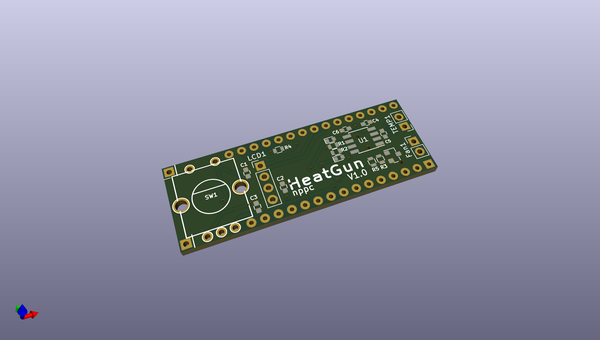
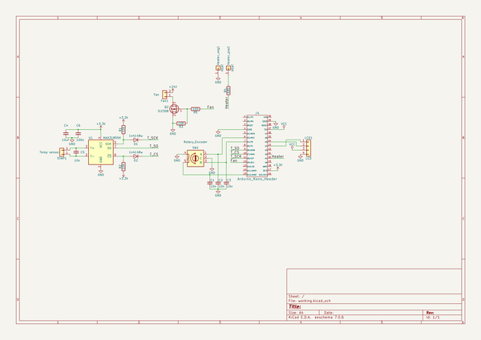

# OOMP Project  
## HotAirGunController  by nppc  
  
(snippet of original readme)  
  
- HotAirGunController  
-- Controller for Hot Air Gun with 220v heater and 24v fan  
You can use Hot Air Desoldering Gun Handle FOR 858 858D 898D 852D Soldering Station Hot-air Rework Station  
  
  
  
Arduino Nano  
  
  
  
i2c OLED 0.91'' (128x32 pixels)  
  
  
  
and any 240AC Solid State Switch like CPC1998  
  
PCB from oshpark: https://oshpark.com/shared_projects/ofOX8gMQ  
  
  
  
-- Workable PIDs  
P: 60  
  
I: 3  
  
D: 100  
  
-- Alternative PIDs  
If your PID control goes crazy, then try these PIDs:  
  
P: 40  
  
I: 3  
  
D: 30  
  
  
  full source readme at [readme_src.md](readme_src.md)  
  
source repo at: [https://github.com/nppc/HotAirGunController](https://github.com/nppc/HotAirGunController)  
## Board  
  
  
## Schematic  
  
  
  
[schematic pdf](working_schematic.pdf)  
## Images  
