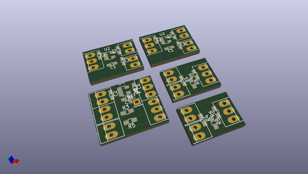
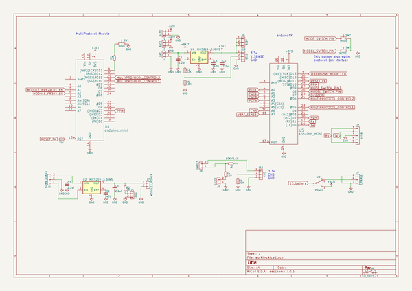

# OOMP Project  
## MiniTX_ER9xrPro  by nppc  
  
(snippet of original readme)  
  
- MiniTX_ER9xrPro  
Project for mini transmitter with gimbals from Er9xr Pro TX  
- Transmitter software  
Software is based on arduinorc project (http://www.reseau.org/arduinorc) with mine modifications.  
Some of the modifications listed here:  
- Added PRT variable to Models to store TX Protocol number  
- Only configured models are selected with Model button  
- Enter/exit Command mode done with push-button, not switch  
- After model is selected, correct Protocol is choosed (rotary dip-switch emulation)  
- Arming (Throttle Cut) is extended to 2 switches  
- some other minor changes  
  
-- Change Models  
To chnage models or to configure the transmitter, press and hold button "C" for 2 seconds to enter/exit Configuration mode.  
So, to change Model you need to go to Configuration mode, press "M" button, and then exit from Configuration mode.  
Every press of "M" button changes to the next Model. If next model is not configured, then first model is selected.  
  
-- Arm/disarm  
Switches on side of the transmitter are used for safe arming. They are both connected to single analog channel A6 with resistors network.  
If both swithces are OFF, then Throttle cut mode is activated.  
If one of the swithces is ON, then Throttle cut mode is off.  
For simple copters one of the switches can be used as arming switch.  
For normal FC safe arming with 2 swithes is possible.  
  
-- Some Commands for configuring the transmitter  
*To configure the transmitter, we need to go to Configure mode. In this mode enabled Serial interface   
  full source readme at [readme_src.md](readme_src.md)  
  
source repo at: [https://github.com/nppc/MiniTX_ER9xrPro](https://github.com/nppc/MiniTX_ER9xrPro)  
## Board  
  
  
## Schematic  
  
  
  
[schematic pdf](working_schematic.pdf)  
## Images  
