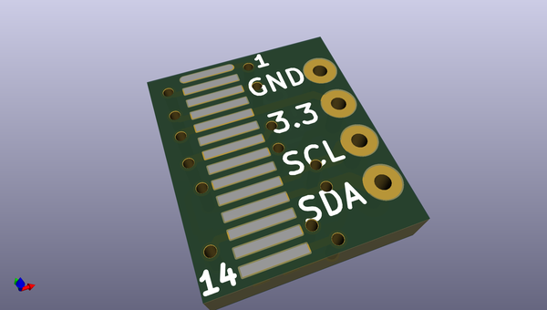
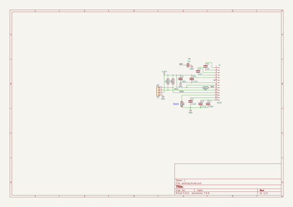

# OOMP Project  
## OLEDInterface  by nppc  
  
(snippet of original readme)  
  
- OLEDInterface  
Interface for small OLED 96x16, SSD1306 (14pin)  
  
  full source readme at [readme_src.md](readme_src.md)  
  
source repo at: [https://github.com/nppc/OLEDInterface](https://github.com/nppc/OLEDInterface)  
## Board  
  
  
## Schematic  
  
  
  
[schematic pdf](working_schematic.pdf)  
## Images  
