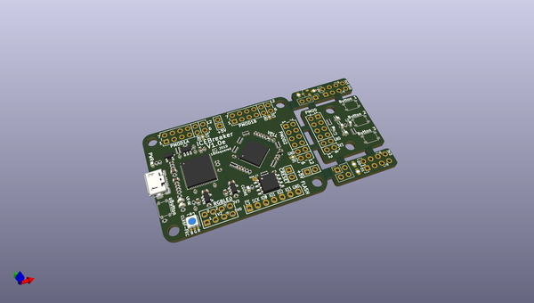
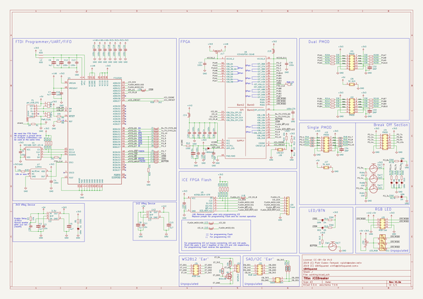

# OOMP Project  
## icebreaker  by nqbit  
  
oomp key: oomp_projects_flat_nqbit_icebreaker  
(snippet of original readme)  
  
- ICEBreaker FPGA  
  
   
  
The iCEBreaker FPGA board is a low cost, open-source educational FPGA  
development board.  
  
The main motivating application of this board is for classes and workshops  
teaching the use of the open source FPGA design flow using  
[Yosys](http://www.clifford.at/yosys/),  
[nextpnr](https://github.com/YosysHQ/nextpnr),  
[icestorm](http://www.clifford.at/icestorm/),  
[iverilog](http://iverilog.icarus.com/),  
[symbiflow](https://github.com/SymbiFlow) and others. This means the board has  
to be low cost and have a nice set of features to allow for the design of  
interesting classes and workshop exercises. At the same time we want to allow  
the user to use the proprietary vendor tools if they choose to. Because of that  
we need to be compatible with their firmware upload tools.  
  
- Hardware Specifications  
  
* iCE40UP5K in QFN48 (SG48) package  
  * [iCE40 UltraPlus 5K](http://www.latticesemi.com/-/media/LatticeSemi/Documents/DataSheets/iCE/iCE40-UltraPlus-Family-Data-Sheet.ashx)  
  * 5280 Logic Cells (4-LUT + Carry + FF)  
  * 128 KBit Dual-Port Block RAM  
  * 1 MBit (128 KB) Single-Port RAM  
  * PLL, Two SPI and two I2C hard IPs  
  * Two internal oscillators (10 kHz  
  full source readme at [readme_src.md](readme_src.md)  
  
source repo at: [https://github.com/nqbit/icebreaker](https://github.com/nqbit/icebreaker)  
## Board  
  
  
## Schematic  
  
  
  
[schematic pdf](working_schematic.pdf)  
## Images  
