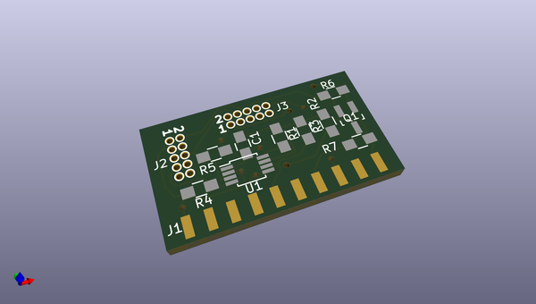
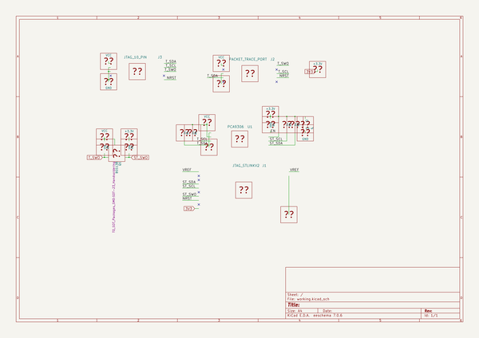

# OOMP Project  
## kicad-boards  by nqbit  
  
oomp key: oomp_projects_flat_nqbit_kicad_boards  
(snippet of original readme)  
  
- kicad-boards  
  
--- BeMicro Max 10 Development Board Template  
  
Created a little board template for http://www.alterawiki.com/wiki/BeMicro_Max_10.  
  
--- SWD Shifter  
  
The ST-Link/V2 debugger does not perform level shifting properly, the SWD Shifter translates the levels appropriately from the the ST-Link debugger.  
  full source readme at [readme_src.md](readme_src.md)  
  
source repo at: [https://github.com/nqbit/kicad-boards](https://github.com/nqbit/kicad-boards)  
## Board  
  
  
## Schematic  
  
  
  
[schematic pdf](working_schematic.pdf)  
## Images  
