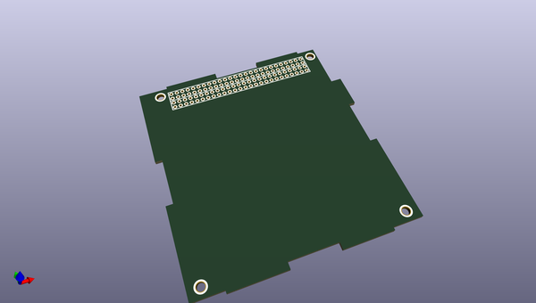
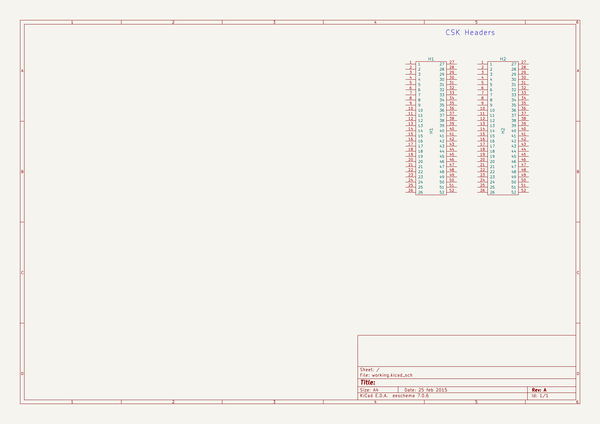

# OOMP Project  
## KiCad-Libraries  by nutbolt  
  
oomp key: oomp_projects_flat_nutbolt_kicad_libraries  
(snippet of original readme)  
  
- KiCad Libraries  
  
A library containing Kicad schematic symbols, footprints, and project templates.  
  
-- License  
  
This library is licensed under the Creative Commons BY-SA 4.0 license. The full legal text of the license may be found in the LICENSE.txt file in this repository. For more information about this license, please visit the Creative Commons Foundation (http://creativecommons.org/licenses/by-sa/4.0/).  
  
-- Using this library  
  
--- Component Files  
  
The suggested method of using the components from this library is to keep a local copy inside your project's git repository. Changes can then be made on that local copy for the project, and pushed back to the main branch.  
  
To get the contents of this library into a project git repository:  
  
1. Add the remote link:  
  
    ``` git remote add libraries https://github.com/imciner2/KiCad-Libraries.git ```  
  
2. Get the current libraries:  
  
    ``` git fetch libraries ```  
  
3. Initially add the libraries to a project:  
  
    ``` git read-tree --prefix=2-Hardware/libraries -u libraries/master ```  
  
4. Commit the libraries into the repository:  
  
    ``` git commit -m "Kicad libraries initial commit" ```  
  
  
To read in any changes from remote into the project repository:  
  
1. Fetch the changes  
  
    ``` git fetch libraries ```  
  
2. Merge the changes  
  
    ``` git merge -s subtree --squash libraries/master ```  
  
3. Commit the changes  
  
    ``` git commit -m "Updated libraries directory" ```  
  
--- Templates  
  
In order to use the templates contained in this fo  
  full source readme at [readme_src.md](readme_src.md)  
  
source repo at: [https://github.com/nutbolt/KiCad-Libraries](https://github.com/nutbolt/KiCad-Libraries)  
## Board  
  
[](working_3d.png)  
## Schematic  
  
[](working_schematic.png)  
  
[schematic pdf](working_schematic.pdf)  
## Images  
