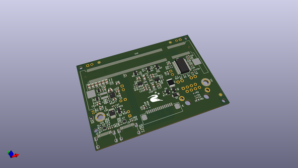
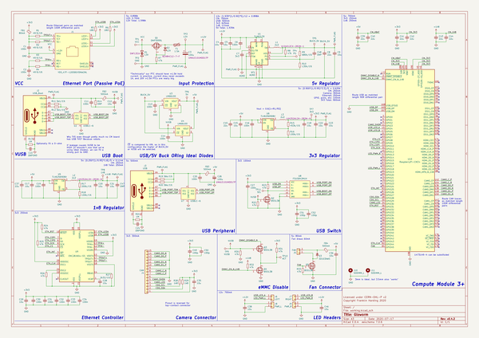

# OOMP Project  
## gloworm  by nxmq  
  
oomp key: oomp_projects_flat_nxmq_gloworm  
(snippet of original readme)  
  
- Gloworm  
  
This repository contains the hardware source for the [Gloworm](https://gloworm.vision) mainboard, ledboard, and case. Before contributing, please open an issue and coordinate with the maintainers as to avoid wasted work and merge conflicts.  
  
- License  
  
Licensed under the CERN-OHL-P v2. See the [license](cern_ohl_p_v2.pdf) and the [guide](cern_ohl_p_v2_howto.pdf).  
  
- Releases  
  
Visit the [releases](https://github.com/gloworm-vision/gloworm/releases) page for exported Gerber files, BoMs, position files, and STEPs.  
  
  full source readme at [readme_src.md](readme_src.md)  
  
source repo at: [https://github.com/nxmq/gloworm](https://github.com/nxmq/gloworm)  
## Board  
  
  
## Schematic  
  
  
  
[schematic pdf](working_schematic.pdf)  
## Images  
