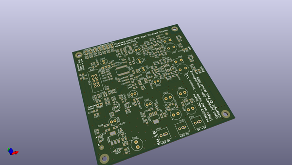
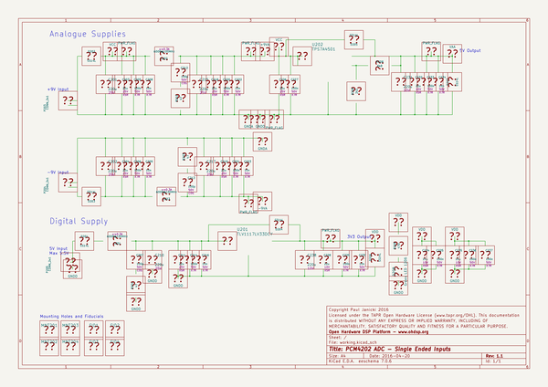

# OOMP Project  
## ADC-PCM4202-SE  by ohdsp  
  
oomp key: oomp_projects_flat_ohdsp_adc_pcm4202_se  
(snippet of original readme)  
  
- [Open Hardware DSP Platform](http://www.ohdsp.org)  
-- PCM4202 ADC with single ended inputs  
--- Revision 1.1  
------ ADC-PCM4202-SE (KiCad 4.0.2-stable)  
---  
- README  
--- Disclaimer  
Copyright Paul Janicki 2016  
  
Licensed under the TAPR Open Hardware License (www.tapr.org/OHL)  
  
This documentation is distributed WITHOUT ANY EXPRESS OR IMPLIED WARRANTY, INCLUDING OF MERCHANTABILITY, SATISFACTORY QUALITY AND FITNESS FOR A PARTICULAR PURPOSE.  
  
--- What is this repository?  
  
**Quick summary**  
  
This is a single ended stereo input PCM4202 ADC. This is designed as part the Open Hardware DSP Platform.    
  
The PCM4202 is a hardware controlled Delta-Sigma ADC.  
  
This repository contains the KiCad design files, manufacturing Gerber/drill files, and PDF/drawing files for this board.  
  
--- What is the project folder structure?  
Starting from the top level: \  
*ADC-PCM4202-SE*  
+ *Bill of Materials*  - This contains the bill of materials in CVS, LibreOffice Calc and XML formats  
+ *Drawings*  
    + *PCB* - This contains SVG and PDF outputs of PCB copper layers and assembly drawings  
    + *Schematics* - This contains the PDF schematic drawing  
+ *Gerbers* - This contains the PCB Gerbers and drill drawings for manufacture, there is also a zip file ready to send to most manufacturers  
+ *KiCad* - This contains the original KiCad schematic and PCB design files  
  
  
--- How do I get set up?  
  
**Summary of set up**  
  
1. Set your self up a directory on a local disk, something simple will make life easier (eg C:\Elec  
  full source readme at [readme_src.md](readme_src.md)  
  
source repo at: [https://github.com/ohdsp/ADC-PCM4202-SE](https://github.com/ohdsp/ADC-PCM4202-SE)  
## Board  
  
  
## Schematic  
  
  
  
[schematic pdf](working_schematic.pdf)  
## Images  
