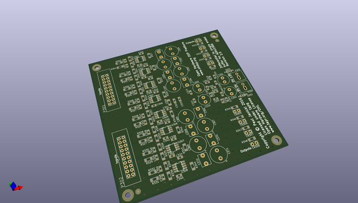
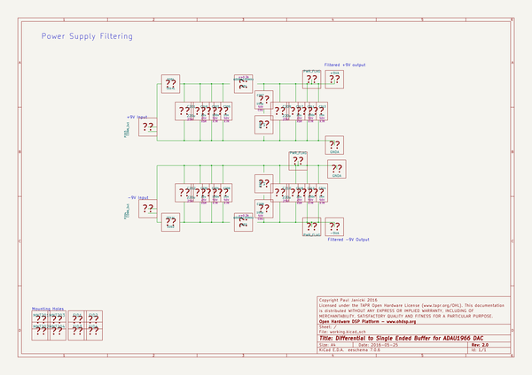

# OOMP Project  
## BUF-DiffToSE-ADAU1966  by ohdsp  
  
oomp key: oomp_projects_flat_ohdsp_buf_difftose_adau1966  
(snippet of original readme)  
  
- [Open Hardware DSP Platform](http://www.ohdsp.org)  
-- Differential to single ended buffer for ADAU1966 DAC  
--- Revision 1.1  
------ BUF-DiffToSE-ADAU1966 (KiCad 4.0.2-stable)  
---  
- README  
--- Disclaimer  
Copyright Paul Janicki 2016  
  
Licensed under the TAPR Open Hardware License (www.tapr.org/OHL)  
  
This documentation is distributed WITHOUT ANY EXPRESS OR IMPLIED WARRANTY, INCLUDING OF MERCHANTABILITY, SATISFACTORY QUALITY AND FITNESS FOR A PARTICULAR PURPOSE.  
  
--- What is this repository? ---  
  
**Quick summary**  
  
This is a differential to single ended active buffer for the ADAU1966 DAC. This is designed as part the Open Hardware DSP Platform. This may or may not be suitable for use in other applications.   
  
This repository contains the KiCad design files, manufacturing Gerber/drill files, and PDF/drawing files for this board.  
  
--- What is the project folder structure?  
Most folder names are self explanatory. Starting from the top level: \  
*BUF-DiffToSE-ADAU1966*  
+ *Bill of Materials*  - This contains the bill of materials in CVS, LibreOffice Calc and XML formats  
+ *Drawings*  
    + *PCB* - This contains SVG and PDF outputs of PCB copper layers and assembly drawings  
    + *Schematics* - This contains the PDF schematic drawing  
+ *Gerbers* - This contains the PCB Gerbers and drill drawings for manufacture, there is also a zip file ready to send to most manufacturers  
+ *KiCad* - This contains the original KiCad schematic and PCB design files  
  
--- How do I get set up? ---  
  
**Summary of  
  full source readme at [readme_src.md](readme_src.md)  
  
source repo at: [https://github.com/ohdsp/BUF-DiffToSE-ADAU1966](https://github.com/ohdsp/BUF-DiffToSE-ADAU1966)  
## Board  
  
  
## Schematic  
  
  
  
[schematic pdf](working_schematic.pdf)  
## Images  
