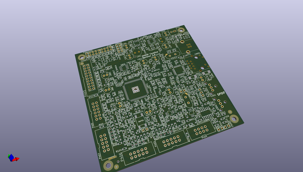
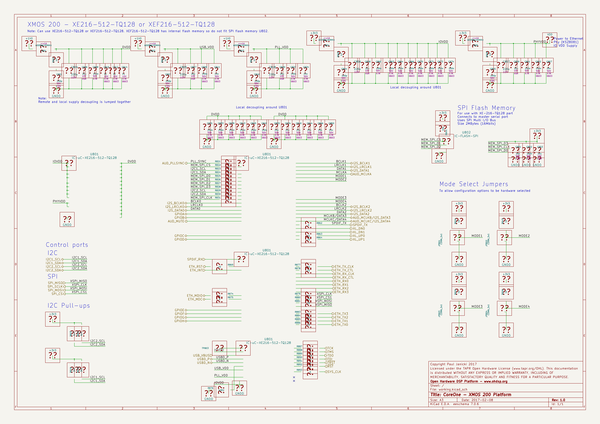

# OOMP Project  
## CoreOne-xCORE200-Original  by ohdsp  
  
oomp key: oomp_projects_flat_ohdsp_coreone_xcore200_original  
(snippet of original readme)  
  
- [Open Hardware DSP Platform](http://www.ohdsp.org)  
-- CoreOne  
--- Revision 1.0  
  
---  
- README  
--- Disclaimer  
Copyright Paul Janicki 2017  
  
Licensed under the TAPR Open Hardware License (www.tapr.org/OHL)  
  
This documentation is distributed WITHOUT ANY EXPRESS OR IMPLIED WARRANTY, INCLUDING OF MERCHANTABILITY, SATISFACTORY QUALITY AND FITNESS FOR A PARTICULAR PURPOSE.  
  
--- What is this repository?  
  
**Quick summary**  
  
This is Open Hardware DSP Platform CoreOne Module.   
  
This is an XMOS 200 based DSP and microcontroller PCB design with USB, SPDIF, I2S/TDM, SPI, I2C, and Ethernet connectivity options.  
  
This repository contains the KiCad design files, manufacturing Gerber/drill files, PDF/drawing files, and relevant documenation for this board.  
  
--- What is the project folder structure?  
Most folder names are self explanatory. Starting from the top level: \  
*CoreOne*  
+ *Bill of Materials*  - This contains the bill of materials in CVS, LibreOffice Calc and XML formats  
+ *Calculations*  - This contains calculations performed using SMath Studio   
+ *Drawings*  - This contains PDF and SVG outputs of schematic and PCB files  
+ *Gerbers* - This contains the PCB Gerbers and drill drawings for manufacture, there is also a zip file ready to send to most manufacturers  
+ *KiCad* - This contains the original KiCad schematic and PCB design files  
+ *Pick and Place* - This contains the pick and place file for automated placement of PCB components  
  
--- How do I get set up?  
  
**Summary of set up**  
  
1.   
  full source readme at [readme_src.md](readme_src.md)  
  
source repo at: [https://github.com/ohdsp/CoreOne-xCORE200-Original](https://github.com/ohdsp/CoreOne-xCORE200-Original)  
## Board  
  
  
## Schematic  
  
  
  
[schematic pdf](working_schematic.pdf)  
## Images  
