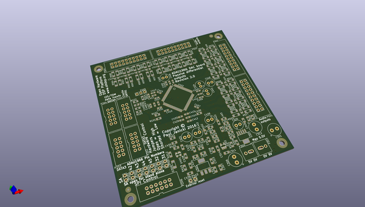
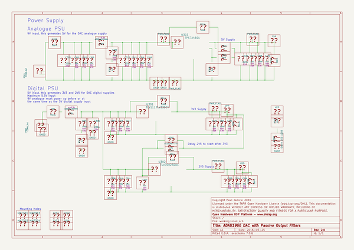

# OOMP Project  
## DAC-ADAU1966  by ohdsp  
  
oomp key: oomp_projects_flat_ohdsp_dac_adau1966  
(snippet of original readme)  
  
- [Open Hardware DSP Platform](http://www.ohdsp.org)  
-- ADAU1966 DAC with passive output filters  
--- Revision 2.0  
------ DAC-ADAU1966 (KiCad 4.0.2-stable)  
---  
- README  
--- Disclaimer  
Copyright Paul Janicki 2016  
  
Licensed under the TAPR Open Hardware License (www.tapr.org/OHL)  
  
This documentation is distributed WITHOUT ANY EXPRESS OR IMPLIED WARRANTY, INCLUDING OF MERCHANTABILITY, SATISFACTORY QUALITY AND FITNESS FOR A PARTICULAR PURPOSE.  
  
--- What is this repository? ---  
  
**Quick summary**  
  
This is a digital to analogue converter based on the ADAU1966 DAC chip from Analog Devices. This is designed as part the Open Hardware DSP Platform. This may or may not be suitable for use in other applications.   
  
This simple 16 channel DAC is designed to be used with 4xTDM4, 2xTDM8 or 1xTDM16 data inputs supported on devices such as the ADAU1452. This board can be used with the ADAU1966 in standalone mode (no host microcontroller needed) or with an external I2C interface to program/control the ADAU1966. The board uses only passive output filters on the ADAU1966 but can easily drive external PCBs through appropriate cabling.  
  
This repository contains the KiCad design files, manufacturing Gerber/drill files, and PDF/drawing files for this board.  
  
--- What is the project folder structure?  
Most folder names are self explanatory. Starting from the top level: \  
*DAC-ADAU1966*  
+ *Bill of Materials*  - This contains the bill of materials in CVS, LibreOffice Calc and XML formats  
+ *Drawings*  
    +  
  full source readme at [readme_src.md](readme_src.md)  
  
source repo at: [https://github.com/ohdsp/DAC-ADAU1966](https://github.com/ohdsp/DAC-ADAU1966)  
## Board  
  
  
## Schematic  
  
  
  
[schematic pdf](working_schematic.pdf)  
## Images  
