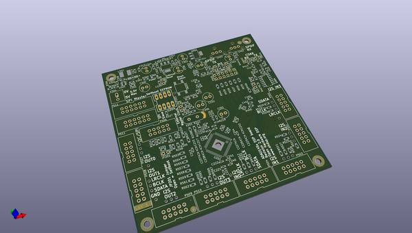
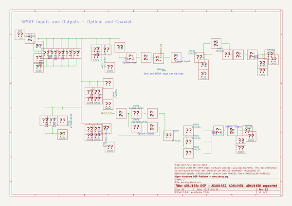

# OOMP Project  
## DSP-ADAU1452  by ohdsp  
  
(snippet of original readme)  
  
- [Open Hardware DSP Platform](http://www.ohdsp.org)  
-- ADAU145x DSP supporting ADAU1452, ADAU1451, and ADAU1450 devices  
--- Revision 2.0  
------ DSP-ADAU1452 (KiCad 4.0.2-stable)  
---  
- README  
--- Disclaimer  
Copyright Paul Janicki 2015  
  
Licensed under the TAPR Open Hardware License (www.tapr.org/OHL)  
  
This documentation is distributed WITHOUT ANY EXPRESS OR IMPLIED WARRANTY, INCLUDING OF MERCHANTABILITY, SATISFACTORY QUALITY AND FITNESS FOR A PARTICULAR PURPOSE.  
  
--- What is this repository for?  
  
**Quick summary**  
  
This is a simple self-bootable ADAU1450, ADAU1451, or ADAU1452 based DSP board with 4 I2S (TDM/left and right justified and more) input and 4 output connectors. When used with the ADAU1451 and ADAU1452 parts there are also optical and coaxial SPDIF input and output connectors.   
  
There is an I2C/SPI connector for connection to the Analog Devices SigmaStudio USBi to EZ-Board Adapter (ADZS-USBI2EZB) or anything that will do the same job (eg freeUSBi). The board also features master and slave SPI connectors for use with other OHDSP boards. The board has space for a self-boot EEPROM and so with the ADZS-USBI2EZB or compatible device the board can be programmed as you wish and will selfboot the last program written when enabled.   
  
This board forms the core of the open hardware DSP platform which is designed to be a highly customisable and flexible DSP platform.   
  
This repository contains the KiCad design files, manufacturing Gerber/drill files, and PDF/drawing files for t  
  full source readme at [readme_src.md](readme_src.md)  
  
source repo at: [https://github.com/ohdsp/DSP-ADAU1452](https://github.com/ohdsp/DSP-ADAU1452)  
## Board  
  
  
## Schematic  
  
  
  
[schematic pdf](working_schematic.pdf)  
## Images  
