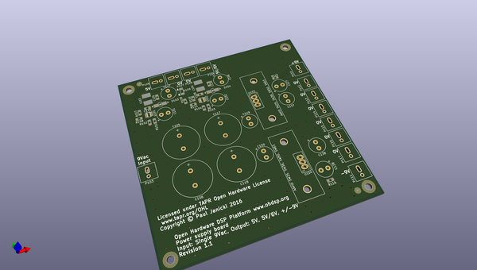
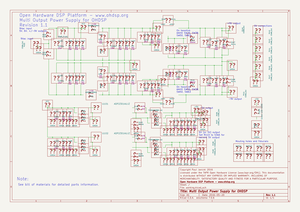

# OOMP Project  
## PSU-5V-6V-Dual9V  by ohdsp  
  
oomp key: oomp_projects_flat_ohdsp_psu_5v_6v_dual9v  
(snippet of original readme)  
  
- [Open Hardware DSP Platform](http://www.ohdsp.org)  
-- Multi output power supply for OHDSP  
--- Revision 1.1  
------ PSU-5V-6V-Dual9V (KiCad 4.0.2-stable)  
---  
- README  
--- Disclaimer  
Copyright Paul Janicki 2016  
  
Licensed under the TAPR Open Hardware License (www.tapr.org/OHL)  
  
This documentation is distributed WITHOUT ANY EXPRESS OR IMPLIED WARRANTY, INCLUDING OF MERCHANTABILITY, SATISFACTORY QUALITY AND FITNESS FOR A PARTICULAR PURPOSE.  
  
--- What is this repository? ---  
  
**Quick summary**  
  
This is a power supply for use with OHDSP boards.  
  
This power supply requires a single 9Vac input (around 500mA should be sufficient for simple systems).   
  
This power supply outputs one 5V, one 5V or 6V, and +/-9V. Be warned that each of the 5V and 6V rail should be able to deliver higher currents (up to 1A) without issue, but this will overload the input if you are not careful.  
  
This repository contains the KiCad design files, manufacturing Gerber/drill files, and PDF/drawing files for this board.  
  
  
--- How do I get set up? ---  
  
**Summary of set up**  
  
1. Set your self up a directory on a local disk, something simple will make life easier (eg C:\Electronics on Windows as used here), but anywhere will do just fine.  
2. Download the Kicad-Libs from [https://github.com/ohdsp/KiCad-Libs](https://github.com/ohdsp/KiCad-Libs) and place in C:\Electronics\Kicad-Libs (or your chosen folder)    
3. Create a OHDSP subdirectory in C:\Electronics (so C:\Electronics\OHDSP)  
3. Download this project to C:\Ele  
  full source readme at [readme_src.md](readme_src.md)  
  
source repo at: [https://github.com/ohdsp/PSU-5V-6V-Dual9V](https://github.com/ohdsp/PSU-5V-6V-Dual9V)  
## Board  
  
  
## Schematic  
  
  
  
[schematic pdf](working_schematic.pdf)  
## Images  
