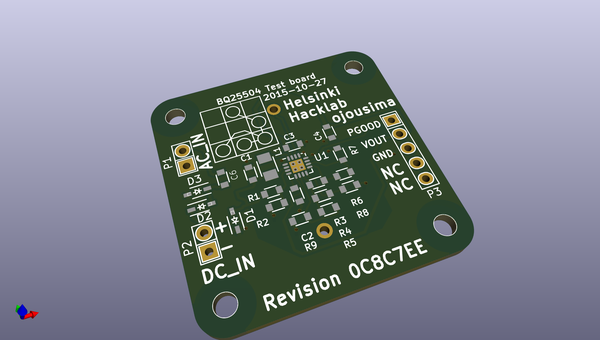
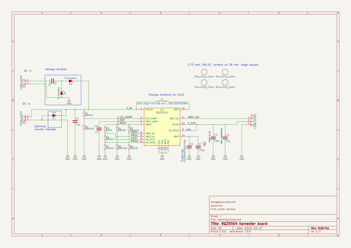

# OOMP Project  
## ieeeIV16  by ojousima  
  
oomp key: oomp_projects_flat_ojousima_ieeeiv16  
(snippet of original readme)  
  
- ieeeIV16  
Design materials and measurement results for [IV16](http://iv2016.org/) conference paper Energy Harvesting System for Intelligent Tyre Sensors. I will add link to conference paper itself once the paper is available.  
  
You might also be interested in my [Master's Thesis](https://github.com/ojousima/thesis) which has a lot broader information about the subject of energy harvesting in tyres.  
  
  
  
  full source readme at [readme_src.md](readme_src.md)  
  
source repo at: [https://github.com/ojousima/ieeeIV16](https://github.com/ojousima/ieeeIV16)  
## Board  
  
  
## Schematic  
  
  
  
[schematic pdf](working_schematic.pdf)  
## Images  
