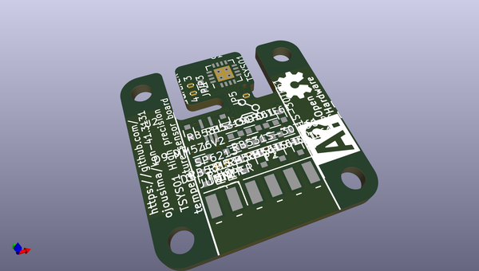
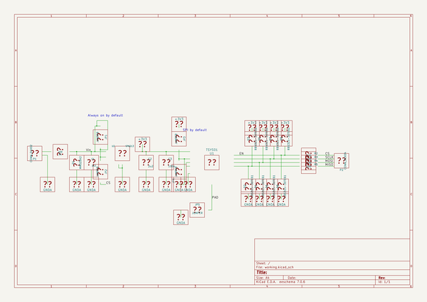

# OOMP Project  
## kon-41.3131  by ojousima  
  
oomp key: oomp_projects_flat_ojousima_kon_41_3131  
(snippet of original readme)  
  
- kon-41.3131  
Aalto university student project for constant temperature controller  
  
  full source readme at [readme_src.md](readme_src.md)  
  
source repo at: [https://github.com/ojousima/kon-41.3131](https://github.com/ojousima/kon-41.3131)  
## Board  
  
  
## Schematic  
  
  
  
[schematic pdf](working_schematic.pdf)  
## Images  
