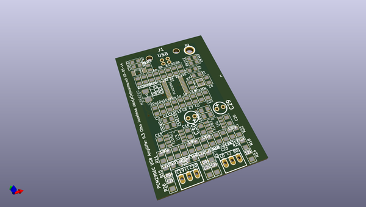
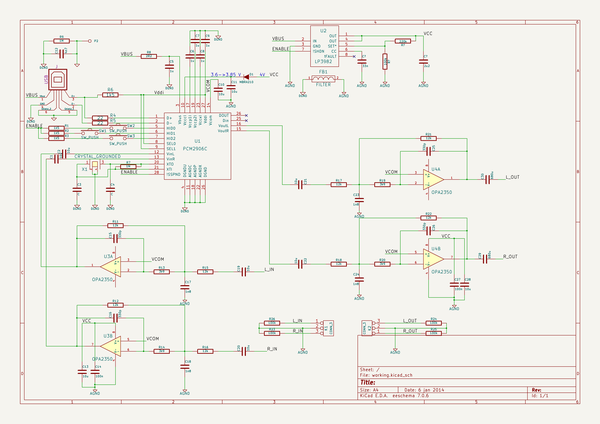

# OOMP Project  
## PCM2906-usb-hpamp  by ojousima  
  
oomp key: oomp_projects_flat_ojousima_pcm2906_usb_hpamp  
(snippet of original readme)  
  
PCM2906-usb-hpamp  
=================  
  
Headphone amplifier based on Texas Instruments PCM2906.  
  
Fits into Hammond enclosure 1455D602. I/O jacks are mounted into panel and wires are soldered to connectors.  
  
Future improvement:  
- All SMD-components  
- Second output to speaker amplifier, mute when headphones are detected  
  
  full source readme at [readme_src.md](readme_src.md)  
  
source repo at: [https://github.com/ojousima/PCM2906-usb-hpamp](https://github.com/ojousima/PCM2906-usb-hpamp)  
## Board  
  
  
## Schematic  
  
  
  
[schematic pdf](working_schematic.pdf)  
## Images  
