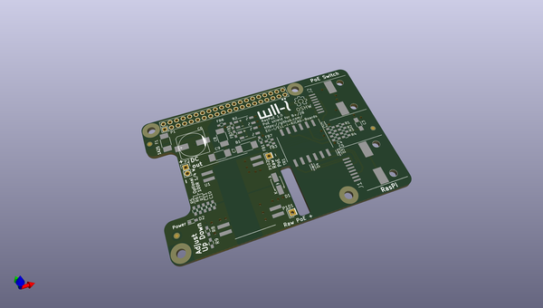
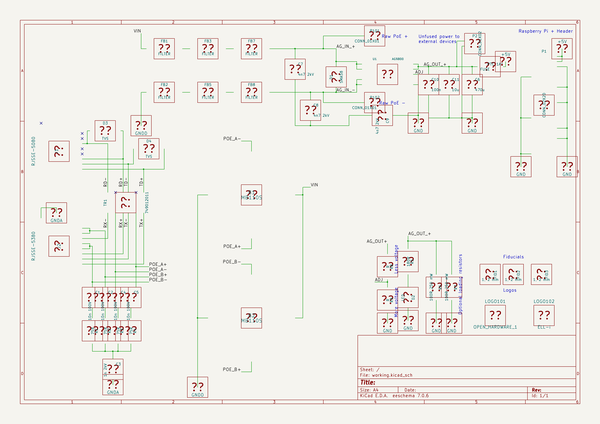

# OOMP Project  
## RaspberryPi-PoE  by ojousima  
  
oomp key: oomp_projects_flat_ojousima_raspberrypi_poe  
(snippet of original readme)  
  
-Nothing to see here, move along.  
  
This repository remains only for historical purposes, the official repository has been moved to https://github.com/Ell-i/ELL-i-KiCAD-Boards.  
  
- RaspberryPi-PoE  
PoE shield for Raspberry Pi+ and 2. Made in KiCAD  
  
  full source readme at [readme_src.md](readme_src.md)  
  
source repo at: [https://github.com/ojousima/RaspberryPi-PoE](https://github.com/ojousima/RaspberryPi-PoE)  
## Board  
  
  
## Schematic  
  
  
  
[schematic pdf](working_schematic.pdf)  
## Images  
