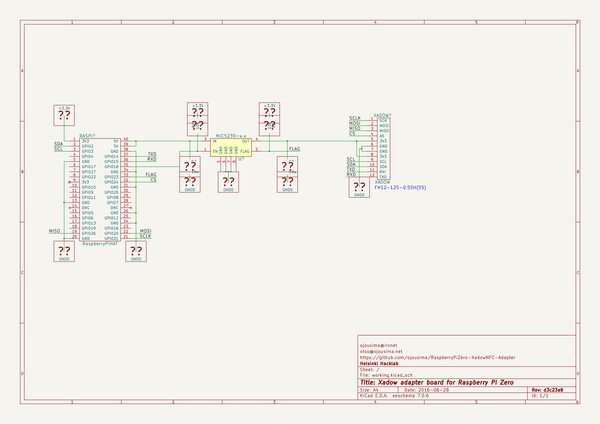

# OOMP Project  
## RaspberryPiZero-XadowNFC-Adapter  by ojousima  
  
oomp key: oomp_projects_flat_ojousima_raspberrypizero_xadownfc_adapter  
(snippet of original readme)  
  
- RaspberryPiZero-XadowNFC-Adapter  
Xadow NFC reader adapter board for Raspberry Pi Zero. Made in KiCAD.  
  
  full source readme at [readme_src.md](readme_src.md)  
  
source repo at: [https://github.com/ojousima/RaspberryPiZero-XadowNFC-Adapter](https://github.com/ojousima/RaspberryPiZero-XadowNFC-Adapter)  
## Board  
  
  
## Schematic  
  
  
  
[schematic pdf](working_schematic.pdf)  
## Images  
