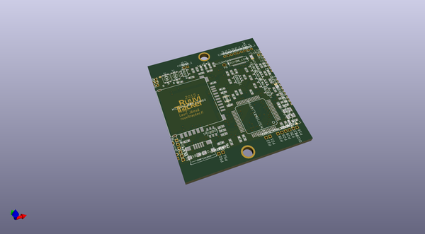

# OOMP Project  
## ruuvitracker_hw  by ojousima  
  
oomp key: oomp_projects_flat_ojousima_ruuvitracker_hw  
(snippet of original readme)  
  
- RuuviTracker: Open Source GPS/GSM Positioning Device  
  
  
  
This repository has all the necessary files to modify and manufacture RuuviTracker hardware.  
  
Latest hardware version is Rev.C3. First one was Rev.A1 and then Rev.B1 came out. And after that, Rev.C1 and Rev.C2. Revisions A, B and C are completely different devices.  
  
All the design files are licensed under Attribution-ShareAlike 4.0 International (CC BY-SA 4.0). Copyright Lauri Jämsä, Ruuvi Innovations Ltd. & Robomaa.com Ltd. Neither the name of the RuuviTracker nor the names of its contributors may be used to endorse or promote products derived from this project without specific prior written permission. While unofficial products should not have "Ruuvi" in their name, it's okay to describe your product in relation to the Ruuvi projects. For more info, drop us a line: license@ruuvi.com.  
  
http://ruuvi.com  
  
If interested of what we're doing and would like to join, our Slack team is the best place to start: http://ruuvi.com/blog/ruuvi-slack-com.html  
  
  full source readme at [readme_src.md](readme_src.md)  
  
source repo at: [https://github.com/ojousima/ruuvitracker_hw](https://github.com/ojousima/ruuvitracker_hw)  
## Board  
  
  
## Schematic  
  
  
  
[schematic pdf](working_schematic.pdf)  
## Images  
