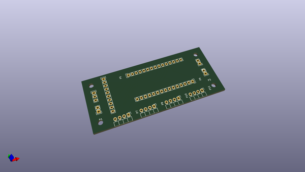
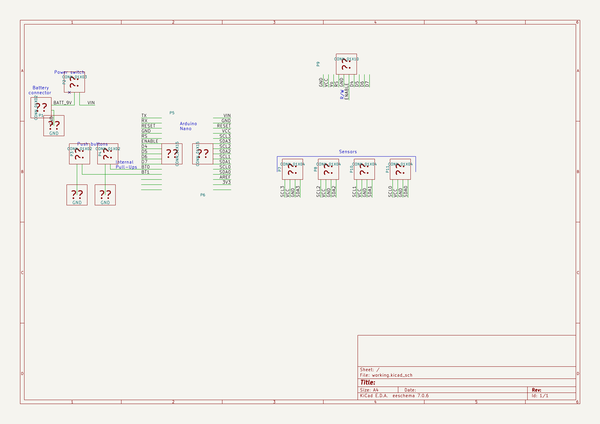

# OOMP Project  
## SHT75-device  by ojousima  
  
(snippet of original readme)  
  
- SHT75-device  
A temperature and humidity sensor project.  
  
  full source readme at [readme_src.md](readme_src.md)  
  
source repo at: [https://github.com/ojousima/SHT75-device](https://github.com/ojousima/SHT75-device)  
## Board  
  
  
## Schematic  
  
  
  
[schematic pdf](working_schematic.pdf)  
## Images  
