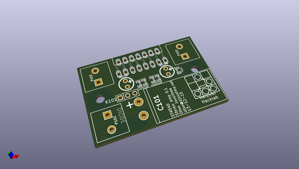

# OOMP Project  
##   by   
  
(snippet of original readme)  
  
STA540-audio-amplifier---KICAD  
==============================  
  
STA540 2 bridged channel audio amplifier, operates in class AB, 12->20 V operating voltage.  
  
  full source readme at [readme_src.md](readme_src.md)  
  
source repo at:   
## Board  
  
  
## Schematic  
  
  
  
[schematic pdf](working_schematic.pdf)  
## Images  
