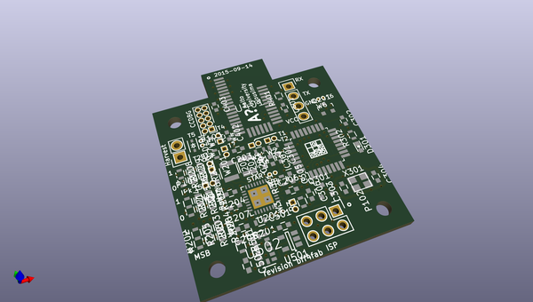
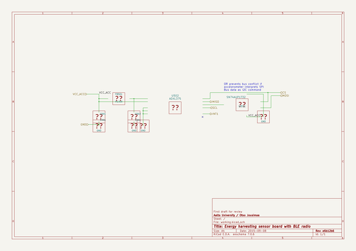

# OOMP Project  
## thesis  by ojousima  
  
(snippet of original readme)  
  
- Energy Harvester Design for Intelligent Tyre Systems  
--TLDR  
Modern tyres can have sensor systems which require energy. Currently these   
systems are powered by batteries, which limit the power available and lifetime  
of the systems. This study presents an energy harvester system to power such  
sensor systems. Piezoelectric and electromagnetic harvester designs are presented  
and the piezoelectric harvester design was selected for use in the tyre. Electrical  
energy was harvested from tyre rotation and deformation, harvested power was  
rectified and stored into a supercapacitor at a voltage level usable by modern  
microcontrollers. Tens of milliwatts of electrical power was obtained from both  
harvesters in a vibration exciter test setup, and the piezoelectric harvester produced  
13 microwatts of electrical power in a chassis dynamometer test rig. Further testing  
indicates 50 microwatts of power is obtainable at a higher speed of the tyre. The  
power obtained from harvester exceeds sleep mode power requirement of sensor  
system, and the sensor system could be theoretically operated intermittently with  
the power available from harvester. Continuous operation of a sensor system is not  
feasible with the presented harvester.  
  
--The Good Parts  
Some of the energy harvesting hardware under folder "hardware" has sparked interest. Printed circuit boards are designed in open source software KiCAD which allows anyone to explore and modify designs without investing in expensive software licenses.   
  full source readme at [readme_src.md](readme_src.md)  
  
source repo at: [https://github.com/ojousima/thesis](https://github.com/ojousima/thesis)  
## Board  
  
  
## Schematic  
  
  
  
[schematic pdf](working_schematic.pdf)  
## Images  
